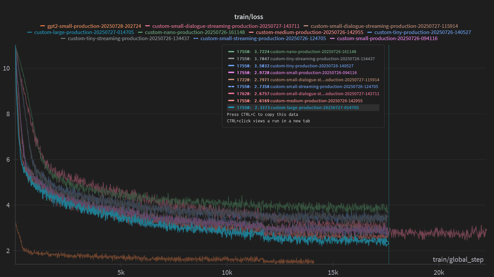

# LLM Training Pipeline

Training pipeline for instruction-response language models using the Alpaca-GPT4 dataset. Supports data analysis, model training, and text generation with both in-memory and streaming data processing.

## Quick Start

```bash
# Train a model
python src/train.py --model custom-tiny --config test

# Generate text
python src/generate.py --model custom-tiny "Explain AI"

# Interactive mode
python src/generate.py --interactive --model custom-tiny

# List available models
python src/generate.py --list-models
```

## Setup

```bash
cd llm
pip install -r requirements.txt
```

Optional WandB integration for experiment tracking:
```bash
cp .env.example .env
# Add API key from https://wandb.ai/authorize
```

## Usage

### Training
```bash
# Basic training
python src/train.py --model custom-tiny --config test

# With custom sample count
python src/train.py --model gpt2-small --config development --samples 500

# Resume from checkpoint
python src/train.py --resume ./models/custom_tiny/checkpoint-1000

# Streaming mode for large datasets
python src/train.py --model custom-medium --config production --streaming
```

### Generation
```bash
# Single prompt
python src/generate.py --model custom-tiny "Write a haiku about coding"

# Batch generation
python src/generate.py --model custom-tiny --file prompts.txt

# Interactive session
python src/generate.py --interactive --model custom-tiny

# With custom parameters
python src/generate.py --model custom-tiny "Tell me a story" --max-length 200 --temperature 0.8
```

## Architecture

```
src/
├── train.py              # Training entry point
├── generate.py           # Text generation interface
├── core/
│   ├── models.py         # Model architectures and loading
│   └── trainer.py        # Training logic and experiment management
├── data/
│   ├── loaders.py        # Dataset loading and preprocessing
│   └── streaming.py      # Large dataset streaming utilities
└── config/
    ├── model_configs.json # Model architecture definitions
    └── settings.py        # Training configurations
```

The pipeline automatically handles model loading, tokenization, dataset preparation, and checkpoint management. Both local CSV files and PostgreSQL databases are supported as data sources.

## Results

We obviously were able to generate valid and meaningful text using pretrained models like GPT-2 and custom fine-tuned models. We will focus here on the best version of our custom model, whose architecture is defined in `src/core/models.py`. It is a transformer-based model, custom-large: 
```json
    "custom-large": {
      "name": "custom-gpt-large",
      "description": "Custom GPT model from scratch (200M parameters)",
      "output_dir": "./src/models/custom_large",
      "from_scratch": true,
      "tokenizer_name": "microsoft/DialoGPT-medium",
      "architecture": {
        "n_embd": 1024,
        "n_layer": 16,
        "n_head": 16,
        "vocab_size": 50257,
        "max_sequence_length": 512,
        "dropout": 0.1
      }
    }
```

Its training loss, along with all the other versions of the model can be seen here:


## Performance Evaluation

The following table shows sample outputs from our custom-large model with quality ratings:

| Question | Model Response | Subjective human Rating |
|----------|----------------|--------|
| **Explain what machine learning is in simple terms.** | Machine learning is a subset of artificial intelligence that involves the use of algorithms to make predictions or decisions based on data that are not explicitly explicitly programmed. It is a type o... | ⭐⭐⭐ (3/5) |
| **How do I make a good cup of coffee?** | Here are some steps you can take to make a great cup of coffee:<br><br>1. Start with your coffee maker and your coffee maker.<br><br>2. Cut up your coffee maker and place it in a glass of water it around the refr... | ⭐⭐ (2/5) |
| **What are the benefits of exercise?** | Working from a diverse diet can be beneficial for individuals who are also seeking to reduce their risk of developing cardiovascular diseases such as diabetes, diabetes, and heart disease.<br><br>1. Improve... | ⭐⭐⭐ (3/5) |
| **Tell me about the solar system.** | The wind system is responsible for driving the wind energy of its solar system. The wind system is designed to generate electricity through wind panels, wind turbines, and other parts of the system. T... | ⭐⭐ (2/5) |
| **What is the capital of France?** | The capital of France is Paris. It is located in Tokyo, with the highest population of approximately 1,10,17,84817,029 feet. It is located in the Pacific Ocean and is located in the world's coast of F... | ⭐⭐ (2/5) |

We see that the model is able to generate valid and meaningful text, but it still has significant room for improvement, especially in terms of factual accuracy and coherence. From our loss curves, we see that increase model size and training time does not necessarily lead to better performance, which may indicate the need for better data quality or just a larger dataset. As for comparison, GPT-2 used a dataset of 40GB, while our custom model was trained on a smaller dataset of less than 100MB.